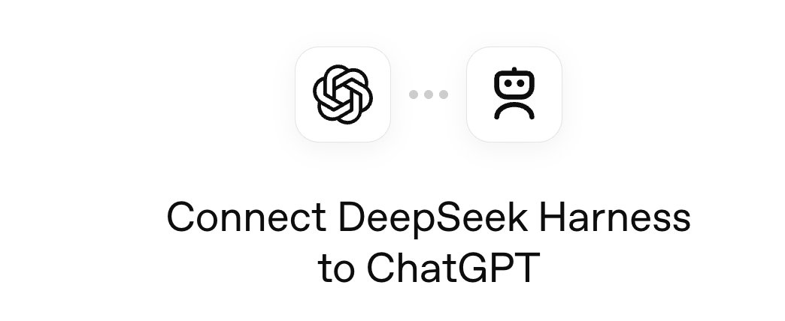
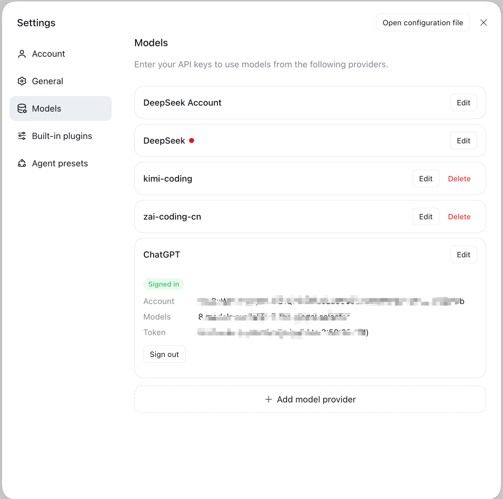
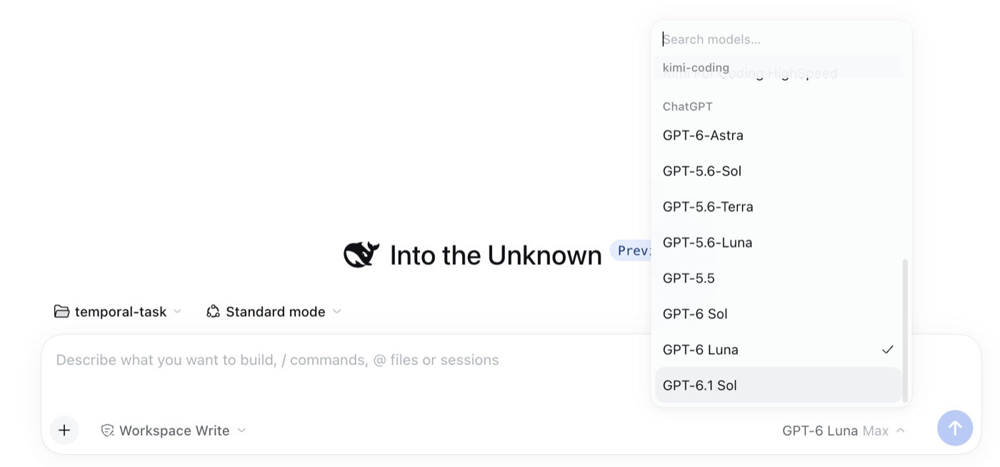
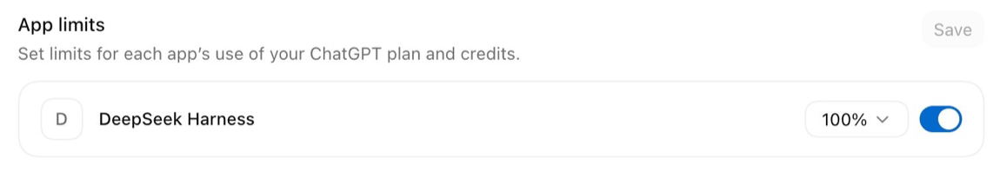

# dsh-plugin-chatgpt

English | [中文](docs/README.zh.md)

Adds one DeepSeek Harness provider route, `chatgpt`, that answers model calls from a signed-in ChatGPT subscription rather than an API key. Signing in uses OpenAI's published *Sign in with ChatGPT* flow, so the account's own plan pays for inference. The route is named `chatgpt` and not `openai` because the built-in pi-ai plugin already owns that name. Models, their context windows, and their reasoning levels come from your account's own listing, so the roster follows your plan rather than a hard-coded list.



## Table of Contents

- [Use this package](#use-this-package)
- [What you get](#what-you-get)
- [Understand the implementation](#understand-the-implementation)
- [Further Exploration](#further-exploration)
- [Model Experience](#model-experience)
- [Known Limitations and Deferred Work](#known-limitations-and-deferred-work)
- [Dev Note](#dev-note)

-----

<a id="use-this-package"></a>
## Use this package

### Install into a profile

The whole install is one line:

```text
dsh plugin --profile <name> add dsh-plugin-chatgpt
```

Restart the harness afterwards: a profile is composed at startup. Removing it:

```text
dsh plugin --profile <name> remove dsh-plugin-chatgpt
```

Until the first npm release the name resolves nothing, so install the prebuilt tarball instead — it needs no build step either:

```text
dsh plugin --profile <name> add https://github.com/ckanner/dsh-plugin-chatgpt/releases/latest/download/dsh-plugin-chatgpt.tgz
```

Installing from the repository URL builds from source, and pnpm refuses a git dependency's build scripts until they are allowlisted, so `add https://github.com/ckanner/dsh-plugin-chatgpt` fails with `ERR_PNPM_GIT_DEP_PREPARE_NOT_ALLOWED`. Either approve `dsh-plugin-chatgpt` under `onlyBuiltDependencies` in the profile's `pnpm-workspace.yaml` and add it again, or install the tarball above.

The package declares `dsh.bundle`, so adding it appends the bundle to the profile's `dsh.profile.bundles` and inserts its row into the composition. Verify the layer without booting:

```text
dsh --profile <name> --dump-config   # shows a "# == dsh-plugin-chatgpt" layer
```

A package installing without a `dsh.bundle` declaration activates no layer; `dsh plugin` warns instead.

### Sign in

Open **Settings → Models**. The plugin owns a **ChatGPT** row, and the card on that row offers **Sign in with ChatGPT**. The card shows the authorization URL and selects it for copying, accepts the final redirect URL pasted back when the browser cannot reach the loopback address, and afterwards reports the account — its plan, the token's next refresh, and how many models it offers — with a **Sign out** button. No token reaches the page.

Signing out revokes the renewable session at the authorization server before clearing it locally, and says so when the server did not confirm.



A headless harness drives the same session object with no browser at all:

```js
import { ChatGptAuth } from 'dsh-plugin-chatgpt/src/auth/manager.ts'

const auth = new ChatGptAuth({
  stateDir: `${process.env.DSH_HOME ?? `${process.env.HOME}/.dsh`}/chatgpt-subscription`,
  agentNameHint: 'DeepSeek Harness',
})

const attempt = await auth.begin()
console.log('Open this URL in your browser:\n' + attempt.authorizationUrl)

// The browser redirects to the loopback listener this attempt bound. If the
// redirect cannot reach it — a headless host, or a blocked popup — paste the
// final URL back instead.
// await attempt.submit('<the full redirect URL from your browser>')

const credential = await attempt.result
auth.adopt(credential)
```

The grant is stored owner-only under `stateDir`. `attempt.submit()` rejects a malformed or mismatched value and leaves the attempt open, so a mistyped paste can be corrected.

-----

<a id="what-you-get"></a>
## What you get

One provider route, listed in **Settings → Models** like any built-in provider, with the model roster, context windows, and reasoning levels the account is entitled to. Selecting a model there is what puts it in the model selector; no separate picker is involved.

Models, their capacities, and their reasoning levels all come from the account's own listing, which describes its models in more detail than the public documentation suggests: it reports a default context and a larger extended one, and asks for the extended one where it exists. Sign-in lives on that row's card.



The share of the plan this installation may spend is set per app, in ChatGPT settings:



-----

<a id="understand-the-implementation"></a>
## Understand the implementation

<details>
<summary>Implementation internals — click to expand</summary>

| Source | Responsibility |
|---|---|
| `cordis.patch.yml` | The layer: one inserted row naming the route and the state directory. |
| `src/index.ts` | The plugin entry: owns the adapter instance and registers the route. |
| `src/auth/protocol.ts` | The exact endpoints, scopes, and loopback rules of the published flow. |
| `src/auth/sign-in.ts` | Authorization: loopback listener and pasted redirect URL, raced. |
| `src/auth/manager.ts` | Stored grants, the active account, and single-flight refresh. |
| `src/auth/store.ts` | Atomic, owner-only credential storage. |
| `src/api/events.ts` | Decoding the Responses event stream and its failure modes. |
| `src/convert/request.ts` | Harness request to Responses body, including the fields the route refuses. |
| `src/convert/blocks.ts` | Wire events to the harness's numbered content blocks. |
| `src/api/client.ts` | The two HTTP calls: list models, run one turn. |
| `src/models/describe.ts` | Availability and capacities, preferring what the account reports over the bundled catalog. |
| `src/adapter.ts` | The harness-facing half of the provider contract. |

Two rules the code enforces rather than documents:

- A request never carries `temperature`, `max_output_tokens`, `top_p`, `truncation`, or the other fields the plan-usage route refuses. They are named in `REFUSED_FIELDS` so they cannot be reintroduced by accident.
- `response.completed` is the only successful terminal. A stream that ends without one is an error, because a truncated answer that reads as finished is worse than a visible failure.
- **The catalog is read at run time, not bundled.** pi-ai ships a static OpenAI catalog — forty-four ids at a fixed 272,000 context — and never asks the account what it has. Measured against a live Plus subscription, that static view is wrong in both directions: it omits models the route serves, and it understates the context the account is offered. This plugin asks `GET /v1/models` with the account's own grant, so entitlement, capacities, and reasoning levels come from the account rather than from a snapshot; the bundled catalog only describes a model the endpoint did not.

</details>

-----

<a id="further-exploration"></a>
## Further Exploration

- [Sign in with ChatGPT: OSS token sharing](https://developers.openai.com/siwc/token-sharing-open-source) — the published flow this implements.
- [Models and inference](https://developers.openai.com/siwc/token-sharing-open-source/models-and-inference) — the listing and request constraints.
- [Preview limitations](https://developers.openai.com/siwc/token-sharing-open-source/preview-limitations) — the capabilities this route does not have yet.

-----

<a id="model-experience"></a>
## Model Experience

This bundle inserts one provider row, and that row's plugin owns all of its model-facing behaviour; the layer itself contributes no prompt, tool, or context of its own.

### Request context and condition

#### What the model sees

For every turn routed to the `chatgpt` provider: the conversation's messages, the system prompt lifted into the request's `instructions` field, any tool declarations the harness supplied, and the reasoning effort the harness selected. Nothing else is added.

#### Token effect

Variable. The plugin adds no tokens beyond what the harness already assembled; it translates and forwards.

#### KV Cache effect

The endpoint's own automatic caching decides, and it does report reads: the plan-usage route refuses `prompt_cache_retention` and takes no `previous_response_id`, so this plugin declares no prefix of its own. Measured across 303 chatgpt turns on one installation, 79 of them reported a cache read, amounting to 7.4% of all billed input. A hit is either the whole of the previous prompt (a 13,440-token read against a 13,624-token predecessor) or a slice of a much longer one. Requests now name a `prompt_cache_key`, which these model generations require for the endpoint's more reliable matching.

## Known Limitations and Deferred Work

- **One account at a time in the UI** — the host keeps every authorized account separate and can sign one out by subject, but the card shows and switches only the active account, so adding a second one means signing out first.
- **Images and files are not sent** — an image or file block carries a durable attachment reference that this adapter does not resolve, so it reaches the model as the placeholder text `[image omitted: not yet supported]`. The omission is visible rather than silent, but the content is genuinely lost.
- **The plan-usage route is in preview** — computer use, Code Interpreter, file search, hosted MCP, image generation, and `tool_search` are refused upstream regardless of what this plugin sends, and `multi_agent`, `temperature`, and `max_output_tokens` are among fifteen fields that must be omitted.
- **The roster mixes two sources with different authority** — the account's listing supplies advertised models with the endpoint's own metadata; the models this route measurably serves but the listing omits are added from `src/models/served.ts`, dated by when they were measured. A listing that changes under a stale measurement will show extras that no longer answer, and `includeUnlisted: false` narrows the roster to the account's own answer.
- **One installation, one host id** — the host id is scoped to the state directory. Two profiles sharing one directory are one installation to OpenAI; two directories are two, and each is consented separately.
- **`agent_name_hint` is a constant** — it defaults to `DeepSeek Harness` and can be overridden per profile, but it is what a human reads on the consent screen and what OpenAI records as this app's identity, so changing it changes how existing grants are attributed.

- **Context is capped by the served catalog, below the model spec** — the public model pages advertise 1,050,000 tokens, and the account's listing reports a default of 272,000 with an extended 872,000, which is what this adapter uses. The larger figure is not reachable through this surface today, and a client that identifies itself as a coding tool receives 272,000 instead of 872,000. Models added from the measured list have no listing entry, so they are reported at the catalog's 272,000.

- **Signing out is two things, and the card says which happened** — the renewable session is revoked at the authorization server before the credential is cleared here, because a grant deleted locally may still be live elsewhere. When the server cannot be reached the sign-out still completes locally, and the outcome says the remote revocation was not confirmed. An exhausted allowance names ChatGPT's own usage page, since an app-specific limit can apply while the plan itself still has usage.

- **Every Config field is `volatile()`, and that is load-bearing** — the harness builds a plugin's settings form from its volatile fields alone, and a plugin with none gets no settings namespace. The Models page renders a provider row only for a row whose namespace exists, so a schema without a volatile field leaves the route, and the card that rides it, impossible to display. Volatile fields are read through `.get()` at the point of use rather than captured as values.

- **The Client half mounts its own Remote namespace** — a bundled third-party plugin cannot reach `ctx.remote.<namespace>` on its own: the Gateway installs a namespace only from a contribution of generated descriptors, and the package carrying those for the shipped API packages is generated at build time from a fixed list of workspace packages. Nothing generates one for an out-of-tree package, and the generator is not published, so this plugin mounts the contribution itself from `src/remote-methods.ts`. A test reads the controller's source and fails when the two lists drift, because a method added on one side only would fail at the moment a user clicks.

- **Signing in announces the new roster to the browser** — a model selector caches the Host catalog and reloads it only when the Host says something changed, so a plugin that fills an empty roster at sign-in time has to publish `llm/adapters-updated`. Without it the models are served and never appear in the selector, which looks exactly like a broken provider. The account card reports how many models the account offers, or why the listing could not be read.

- **The cache-hit readout is the endpoint's own number, and on this route it runs low** — the percentage is `cacheReadTokens / billed input`, and the numerator is only what the endpoint reports in `input_tokens_details.cached_tokens`. Measured over 303 chatgpt turns on one installation it came to 7.4%: 224 of those turns reported no cache read at all, and the rest were either the whole previous prompt or a slice of a much longer one, since those sessions ran from tens of thousands to four hundred thousand prompt tokens. Caching here is automatic and best-effort, and the endpoint documents that a hit needs the same prefix to reach the same machine; each request now names a `prompt_cache_key`, which these model generations require for the more reliable matching. Nothing in the readout is inferred by this plugin.

- **Each installation registers its own client** — ChatGPT settings lists one app row per registration, named by `agent_name_hint`, and this plugin keeps the account/client mapping after signing out so the next sign-in on the same installation reuses its row instead of adding another. A second state directory is a second installation to OpenAI, and registers separately; deleting a state directory is what forgets one.

## Dev Note

```text
npm test          # node --test, no build step
npm run typecheck # entry point checked against dev-types/ shims
npm run build     # tsc emits the host half and the declarations, esbuild the browser bundle
```

`dev-types/` holds development-only declarations for the harness's LLM and Cordis seams, transcribed from the harness sources. They are not published and never shipped; the host supplies the real packages as peer dependencies. An end-to-end mount in a real harness remains the authoritative check.

Regenerate the model catalog when the upstream catalog moves:

```text
node scripts/generate-model-catalog.mjs /path/to/@earendil-works/pi-ai
```
